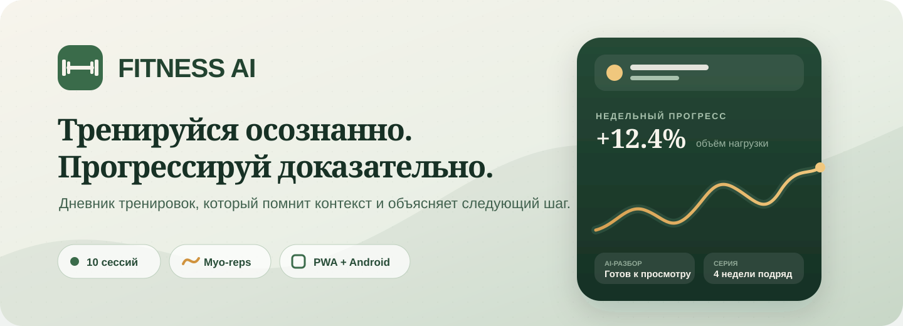
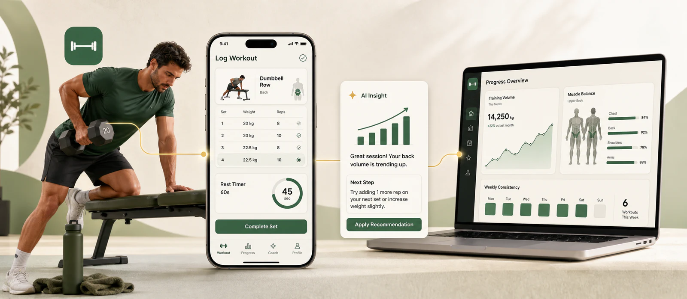
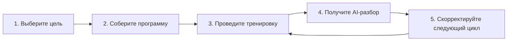

<div align="center">
  
</div>

<div align="center">
  <p>
    <strong>Силовые, круговые и кардио-тренировки, Myo-reps, понятная статистика<br>
    и AI-тренер, который анализирует контекст последних 10 сессий.</strong>
  </p>
  <p>
    <a href="docs/user-guide.md"><strong>Руководство пользователя</strong></a>
    ·
    <a href="https://fitnesss.online"><strong>Открыть Fitness AI</strong></a>
    ·
    <a href="#скачать-приложение"><strong>Скачать приложение</strong></a>
    ·
    <a href="#быстрый-старт">Запустить локально</a>
    ·
    <a href="docs/README.md">Документация</a>
    ·
    <a href="SUPPORT.md">Получить помощь</a>
  </p>
  <p>
    <a href="https://github.com/Artem-Levchenko-hub/Fitness-AI/actions/workflows/ci.yml"></a>
    
    
    
    
    
    <a href="https://github.com/Artem-Levchenko-hub/Fitness-AI/releases/latest"></a>
  </p>
</div>

---

## Зачем нужен Fitness AI

Обычный тренировочный дневник хранит цифры. Fitness AI помогает понять, **что
эти цифры означают и что делать дальше**: где растёт сила, какие мышцы
недополучают нагрузку, когда пора повысить вес, а когда лучше восстановиться.

| Записывайте | Анализируйте | Улучшайте |
|---|---|---|
| Подходы, вес, повторения, RPE, отдых и Myo-reps | Объём, 1RM, PR, недельную активность и мышечный баланс | Шаблоны, технику, распределение нагрузки и восстановление |
| Силовые, круговые и кардио-сессии | Сон, питание, вес и заметки | Решения на основе последних 10 тренировок |

## Как это работает

<div align="center">
  
  <sub>Один понятный цикл: записали подходы → увидели динамику → получили следующий шаг.</sub>
</div>

<br>



1. Заполните профиль, цель и доступное оборудование.
2. Создайте собственный шаблон или программу с помощью AI.
3. Фиксируйте обычные подходы, разминку, дроп-сеты и Myo-reps.
4. После тренировки получите разбор с учётом десяти последних сессий.
5. Следите за трендами и сохраняйте новые версии шаблонов без потери истории.

[Открыть подробное руководство →](docs/user-guide.md)

## Возможности

<table>
  <tr>
    <td width="50%" valign="top">
      <h3>🏋️ Тренировки</h3>
      <ul>
        <li>силовые, круговые и кардио-сессии;</li>
        <li>таймер отдыха и быстрый ввод подходов;</li>
        <li>Myo-reps и специальные типы сетов;</li>
        <li>версии и адаптация шаблонов;</li>
        <li>дедупликация каталога упражнений.</li>
      </ul>
    </td>
    <td width="50%" valign="top">
      <h3>📈 Прогресс</h3>
      <ul>
        <li>объём нагрузки, расчётный 1RM и личные рекорды;</li>
        <li>недельная активность и серии тренировок;</li>
        <li>распределение по группам мышц;</li>
        <li>сон, питание и параметры тела;</li>
        <li>долговременные заметки.</li>
      </ul>
    </td>
  </tr>
  <tr>
    <td width="50%" valign="top">
      <h3>🧠 AI-тренер</h3>
      <ul>
        <li>контекст последних 10 тренировок;</li>
        <li>разбор завершённой сессии;</li>
        <li>follow-up диалог по рекомендациям;</li>
        <li>адаптация программы по фактическому прогрессу;</li>
        <li>контролируемая стоимость каждого AI-вызова.</li>
      </ul>
    </td>
    <td width="50%" valign="top">
      <h3>📱 На любом устройстве</h3>
      <ul>
        <li>адаптивный web-интерфейс;</li>
        <li>установка как PWA в Windows и Android;</li>
        <li>offline shell и push-уведомления;</li>
        <li>Android TWA release track;</li>
        <li>публичные ссылки и друзья.</li>
      </ul>
    </td>
  </tr>
</table>

## Скачать приложение

<table>
  <tr>
    <td width="50%" align="center" valign="top">
      <h3>🖥️ Vibe-trainer Desktop</h3>
      <p>Ноутбуки и компьютеры с Windows 10/11 · x64</p>
      <a href="https://github.com/Artem-Levchenko-hub/Fitness-AI/releases/download/v1.1.0/Vibe-trainer-Windows-x64-Setup-v1.1.0.exe">
        
      </a>
    </td>
    <td width="50%" align="center" valign="top">
      <h3>🤖 Vibe-trainer Mobile</h3>
      <p>Телефоны и планшеты с Android 6.0+</p>
      <a href="https://github.com/Artem-Levchenko-hub/Fitness-AI/releases/download/v1.1.0/Vibe-trainer-Android-v1.1.0.apk">
        
      </a>
    </td>
  </tr>
</table>

Обе версии используют фирменную зелёную иконку Vibe-trainer и открывают один
аккаунт с синхронизированными тренировками. Все файлы и контрольные суммы
доступны в [GitHub Releases](https://github.com/Artem-Levchenko-hub/Fitness-AI/releases/latest).

### Как установить — 3 шага

**🖥️ На ноутбук или компьютер с Windows**

1. Нажмите зелёную кнопку **«Скачать .EXE»** выше.
2. Откройте скачанный файл. Если появилось синее окно SmartScreen, нажмите
   **«Подробнее» → «Выполнить в любом случае»**.
3. Нажимайте **«Далее» → «Установить» → «Готово»**. Vibe-trainer появится на
   рабочем столе и в меню «Пуск».

**🤖 На телефон или планшет с Android**

1. Нажмите зелёную кнопку **«Скачать .APK»** выше и откройте файл.
2. Если Android заблокировал установку, откройте предложенные настройки,
   включите **«Разрешить установку из этого источника»** и вернитесь назад.
3. Нажмите **«Установить» → «Открыть»** и войдите в свой аккаунт.

На странице релиза также лежит файл `.aab`. Он предназначен только для
публикации в Google Play — для обычной установки на телефон выбирайте `.apk`.

Также Fitness AI можно установить как PWA: откройте
[fitnesss.online](https://fitnesss.online) в Edge, Chrome
или Android-браузере и выберите «Установить приложение».

## Подписка и баланс

В проекте подготовлен безопасный платёжный контур ЮKassa:

| Вариант | Тестовая цена | Для чего |
|---|---:|---|
| Fitness AI Pro, месяц | **990 ₽** | Полный доступ без долгого обязательства |
| Fitness AI Pro, год | **9 990 ₽** | Экономия 1 890 ₽ (около 16%) |
| Баланс | Пополнение на выбранную сумму | Оплата отдельных AI-операций |

Поддерживаются сохранённый способ оплаты, автопродление, уведомления,
отмена/возобновление, сверка webhook и возврат неиспользованного пополнения.
Реальные списания закрыты флагами до регистрации магазина и отдельного
подтверждения владельца.

[Посмотреть расчёт цены](docs/subscription-unit-economics-2026-07-30.md) ·
[Открыть чек-лист ЮKassa](docs/yookassa-launch-checklist.md)

## Быстрый старт

Понадобятся Node.js 20+, pnpm и PostgreSQL 15+.

```bash
git clone https://github.com/Artem-Levchenko-hub/Fitness-AI.git
cd Fitness-AI
pnpm install
cp .env.example .env.local
pnpm db:migrate
pnpm db:seed
pnpm dev
```

Откройте [http://localhost:3000](http://localhost:3000). Для обычной разработки
ключи ЮKassa не требуются: платёжные функции останутся выключенными.

Подробная настройка окружения, БД и проверок описана в
[руководстве разработчика](docs/development.md).

## Технологии

```text
Next.js 16 + React 19 + TypeScript
├── Auth.js v5 и вход по magic link
├── PostgreSQL 15 + Drizzle ORM
├── Vercel AI SDK + Gemini/OpenAI-compatible providers
├── YooKassa REST API + server-to-server reconciliation
├── pm2 cron worker + nginx
└── PWA + Android Trusted Web Activity
```

Деньги хранятся только целыми копейками. Webhook не меняет баланс напрямую:
сервер повторно получает платёж у ЮKassa, проверяет сумму, валюту, владельца и
режим, а затем проводит транзакцию с блокировкой строки и ключом
идемпотентности.

## Состояние проекта

| Направление | Статус |
|---|---|
| Web / PWA | Рабочий self-hosted контур |
| AI-тренер | 10-сессионный анализ, jobs и контроль стоимости |
| Статистика | Объём, PR, Myo-reps, мышцы и недельный обзор |
| ЮKassa | Код готов к тестовому магазину, live закрыт флагами |
| Windows | Поддерживается установка как PWA |
| Android | TWA подготовлена, публикация требует отдельной приёмки |

## Документация и помощь

- [Вся документация](docs/README.md)
- [Руководство пользователя](docs/user-guide.md)
- [Настройка для разработчика](docs/development.md)
- [Как предложить изменение](CONTRIBUTING.md)
- [Поддержка и вопросы](SUPPORT.md)
- [Политика безопасности](SECURITY.md)

Перед созданием обращения проверьте [открытые Issues](https://github.com/Artem-Levchenko-hub/Fitness-AI/issues).
Для уязвимостей не используйте публичные Issues: следуйте инструкции в
[SECURITY.md](SECURITY.md).

---

<div align="center">
  <strong>Fitness AI</strong><br>
  Меньше догадок. Больше измеримого прогресса.
</div>
